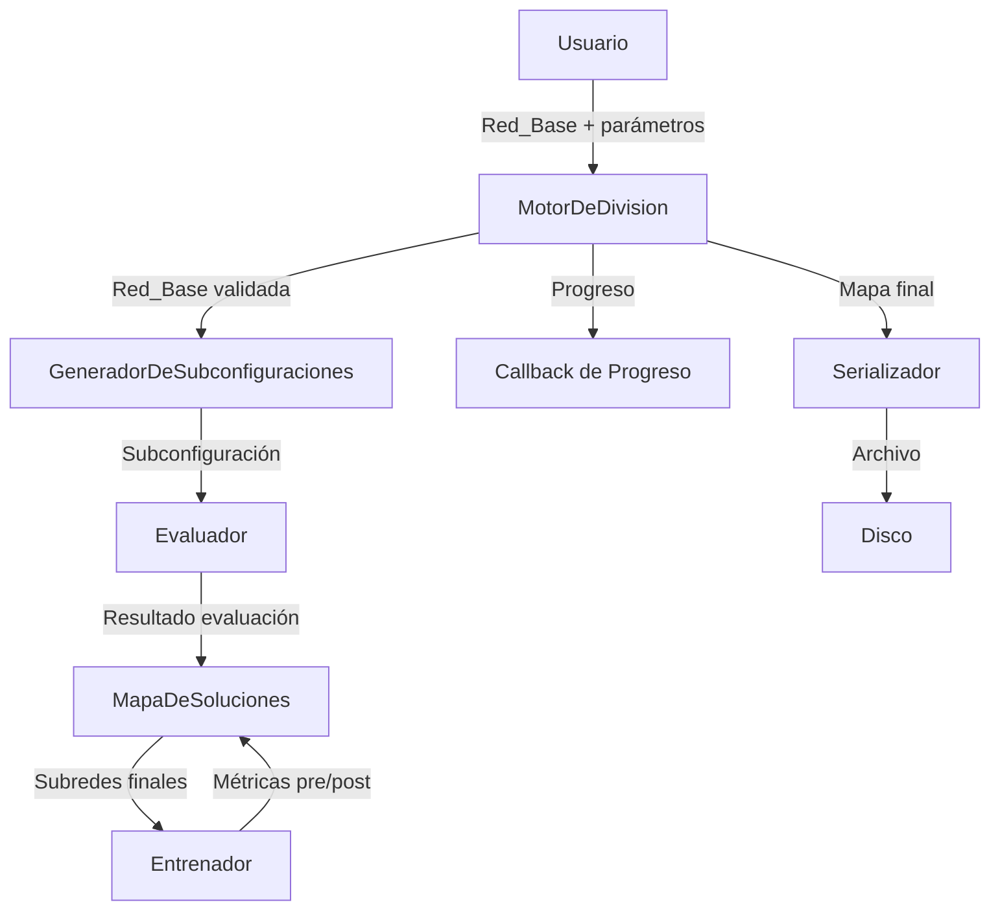
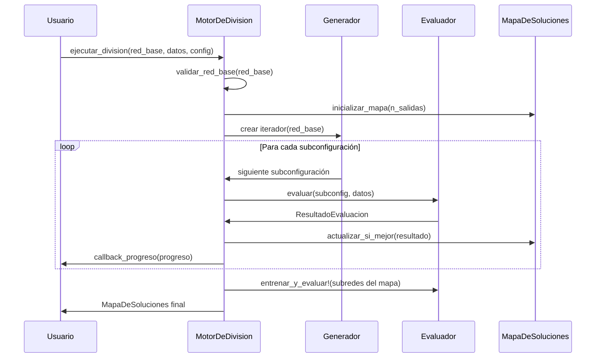

# Documento de Diseño: Método de la División Neuronal

## Visión General

El Método de la División Neuronal implementa una búsqueda exhaustiva de arquitecturas de subredes dentro de una red neuronal inicializada (no entrenada). Dado un número máximo de neuronas de entrada y salida, el sistema genera todas las subconfiguraciones posibles, evalúa cada una contra un conjunto de datos de validación, y almacena las subredes más simples que superan un umbral de acierto configurable (por defecto 0.4). Las subredes resultantes se entrenan al final del proceso, midiendo el rendimiento antes y después del entrenamiento.

La implementación se realiza en Julia, aprovechando su sistema de tipos paramétricos, despacho múltiple, broadcasting y compilación JIT para maximizar el rendimiento en la exploración combinatoria.

## Arquitectura

El sistema sigue una arquitectura modular basada en el patrón pipeline, donde cada componente tiene una responsabilidad clara y se comunica mediante tipos bien definidos.



### Decisiones de Diseño

1. **Tipos paramétricos con `AbstractFloat`**: Todas las estructuras de datos son paramétricas en `T <: AbstractFloat` para soportar `Float32`, `Float64`, etc., manteniendo type stability.

2. **Generador lazy con `Channel`/iterador**: Las subconfiguraciones se generan bajo demanda usando un iterador personalizado, evitando materializar todas las combinaciones en memoria.

3. **Despacho múltiple para evaluación**: El `Evaluador` usa despacho múltiple para soportar distintos tipos de métricas y conjuntos de datos sin condicionales.

4. **Cancelación cooperativa**: El mecanismo de parada usa un `Atomic{Bool}` que se comprueba entre iteraciones, permitiendo finalización ordenada.

5. **Serialización con JLD2**: Se usa el formato JLD2 (nativo de Julia) para serializar el `MapaDeSoluciones`, garantizando preservación exacta de tipos Julia.

## Componentes e Interfaces

### 1. `RedBase{T}`

Estructura que encapsula la red neuronal inicializada.

```julia
struct RedBase{T <: AbstractFloat}
    pesos::Vector{Matrix{T}}      # Pesos por capa [entrada→oculta1, oculta1→oculta2, ..., ocultaN→salida]
    biases::Vector{Vector{T}}     # Biases por capa
    n_entradas::Int               # Número máximo de neuronas de entrada
    n_salidas::Int                # Número máximo de neuronas de salida
end
```

### 2. `Subconfiguracion{T}`

Representa una subred extraída de la `RedBase`.

```julia
struct Subconfiguracion{T <: AbstractFloat}
    indices_entrada::Vector{Int}   # Índices de neuronas de entrada seleccionadas
    indices_salida::Vector{Int}    # Índices de neuronas de salida seleccionadas
    pesos::Vector{Matrix{T}}       # Pesos recortados de la Red_Base
    biases::Vector{Vector{T}}      # Biases recortados
    n_neuronas_activas::Int        # Total de neuronas activas (entrada + ocultas + salida)
end
```

### 3. `ResultadoEvaluacion{T}`

Resultado de evaluar una subconfiguración.

```julia
struct ResultadoEvaluacion{T <: AbstractFloat}
    precision_global::T                          # Precisión sobre todas las salidas
    precisiones_parciales::Dict{Vector{Int}, T}  # Precisión por subconjunto de salidas
end
```

### 4. `EntradaMapaSoluciones{T}`

Entrada individual del mapa de soluciones.

```julia
mutable struct EntradaMapaSoluciones{T <: AbstractFloat}
    subconfiguracion::Union{Nothing, Subconfiguracion{T}}
    precision::T
    precision_pre_entrenamiento::T
    precision_post_entrenamiento::T
end
```

### 5. `MapaDeSoluciones{T}`

Diccionario que almacena las mejores subconfiguraciones.

```julia
struct MapaDeSoluciones{T <: AbstractFloat}
    global_::EntradaMapaSoluciones{T}                        # Solución global
    parciales::Dict{Vector{Int}, EntradaMapaSoluciones{T}}   # Soluciones parciales por subconjunto de salidas
end
```

### 6. `ConfiguracionDivision{T}`

Parámetros de configuración del proceso.

```julia
struct ConfiguracionDivision{T <: AbstractFloat}
    umbral_de_acierto::T    # Valor entre 0.0 y 1.0, por defecto 0.4
end
```

### 7. `ProgresoExploracion`

Estado de progreso reportado durante la exploración.

```julia
struct ProgresoExploracion
    evaluadas::Int                # Subconfiguraciones evaluadas
    total::Int                    # Total de subconfiguraciones
    soluciones_globales::Int      # Número de soluciones globales encontradas
    soluciones_parciales::Int     # Número de soluciones parciales encontradas
end
```

### Interfaces Principales

#### `MotorDeDivision`

```julia
# Punto de entrada principal
function ejecutar_division(
    red_base::RedBase{T},
    datos_validacion,
    config::ConfiguracionDivision{T};
    callback_progreso::Union{Nothing, Function} = nothing,
    señal_parada::Atomic{Bool} = Atomic{Bool}(false)
)::MapaDeSoluciones{T} where T
```

#### `GeneradorDeSubconfiguraciones`

```julia
# Iterador lazy sobre todas las subconfiguraciones
struct GeneradorDeSubconfiguraciones{T <: AbstractFloat}
    red_base::RedBase{T}
end

# Implementa iterate(gen, state) para el protocolo de iteración de Julia
function Base.iterate(gen::GeneradorDeSubconfiguraciones{T}, state=nothing) where T
```

#### `Evaluador`

```julia
# Evalúa una subconfiguración contra datos de validación
function evaluar(
    subconfig::Subconfiguracion{T},
    datos_validacion,
    indices_salida_totales::Vector{Int}
)::ResultadoEvaluacion{T} where T

# Entrena una subconfiguración y devuelve métricas pre/post
function entrenar_y_evaluar!(
    subconfig::Subconfiguracion{T},
    datos_entrenamiento,
    datos_validacion;
    epochs::Int = 100
)::Tuple{T, T} where T  # (precision_pre, precision_post)
```

#### `Serializador`

```julia
# Serialización a disco (formato JLD2)
function serializar(mapa::MapaDeSoluciones{T}, ruta::String) where T
function deserializar(ruta::String)::MapaDeSoluciones
function formatear(mapa::MapaDeSoluciones{T})::String where T  # Pretty printer
```

## Modelos de Datos

### Flujo de Datos Principal



### Generación de Subconfiguraciones

El generador produce subconfiguraciones iterando sobre el producto cartesiano de:
- Todos los subconjuntos no vacíos de neuronas de entrada: `powerset(1:n_entradas)` excluyendo el vacío
- Todos los subconjuntos no vacíos de neuronas de salida: `powerset(1:n_salidas)` excluyendo el vacío

Para cada par `(subset_entrada, subset_salida)`, se extraen los pesos y biases correspondientes de la `RedBase`, recortando las matrices por filas/columnas según los índices seleccionados. Las capas ocultas se mantienen completas (todas las neuronas ocultas participan), ya que la poda se centra en las interfaces de entrada y salida.

El número total de subconfiguraciones es: `(2^n_entradas - 1) × (2^n_salidas - 1)`

### Criterio de Simplicidad

Una `Subconfiguracion` A es más simple que B si:
1. `A.n_neuronas_activas < B.n_neuronas_activas`, o
2. `A.n_neuronas_activas == B.n_neuronas_activas` y `precision(A) > precision(B)`

Este criterio se implementa como una función de comparación:

```julia
function es_mejor(nueva::Subconfiguracion, nueva_prec::T, actual::EntradaMapaSoluciones{T})::Bool where T
    actual.subconfiguracion === nothing && return true
    nueva.n_neuronas_activas < actual.subconfiguracion.n_neuronas_activas && return true
    nueva.n_neuronas_activas == actual.subconfiguracion.n_neuronas_activas && return nueva_prec > actual.precision
    return false
end
```

### Claves del Mapa de Soluciones

Las claves del `MapaDeSoluciones` son vectores de índices de salida ordenados. Para `n_salidas = 3`:
- Solución global: `[1, 2, 3]`
- Soluciones parciales: `[1]`, `[2]`, `[3]`, `[1, 2]`, `[1, 3]`, `[2, 3]`

Total de claves: `2^n_salidas - 1` (todos los subconjuntos no vacíos de salidas).

## Propiedades de Corrección

*Una propiedad es una característica o comportamiento que debe cumplirse en todas las ejecuciones válidas de un sistema — esencialmente, una declaración formal sobre lo que el sistema debe hacer. Las propiedades sirven como puente entre especificaciones legibles por humanos y garantías de corrección verificables por máquina.*

### Propiedad 1: Validación de Red Base

*Para toda* `RedBase` con pesos inicializados y arquitectura definida (vectores de matrices no vacíos), la validación debe aceptarla. *Para toda* `RedBase` con pesos vacíos o dimensiones inconsistentes, la validación debe rechazarla con un error descriptivo.

**Valida: Requisitos 1.1, 1.3**

### Propiedad 2: Registro de límites de entrada/salida

*Para todo* par de enteros positivos `(n_entradas, n_salidas)` proporcionados al motor, el generador de subconfiguraciones debe producir subconfiguraciones cuyos índices de entrada estén en `1:n_entradas` y cuyos índices de salida estén en `1:n_salidas`.

**Valida: Requisitos 1.2**

### Propiedad 3: Enumeración exhaustiva

*Para toda* `RedBase` con `n_entradas` entradas y `n_salidas` salidas, el generador debe producir exactamente `(2^n_entradas - 1) × (2^n_salidas - 1)` subconfiguraciones (excluyendo las descartadas por conexiones inválidas).

**Valida: Requisitos 2.1**

### Propiedad 4: Preservación de pesos

*Para toda* subconfiguración generada a partir de una `RedBase`, los pesos de la subconfiguración deben ser exactamente los valores correspondientes de las matrices de pesos de la `RedBase`, recortados según los índices de entrada y salida seleccionados, incluyendo las conexiones de capas ocultas.

**Valida: Requisitos 2.2, 2.3**

### Propiedad 5: Completitud de evaluación

*Para toda* subconfiguración evaluada, el evaluador debe calcular una precisión global (considerando todas las salidas) y una precisión parcial para cada subconjunto no vacío de salidas del problema.

**Valida: Requisitos 4.1, 4.2, 4.3**

### Propiedad 6: Candidatura por umbral

*Para toda* subconfiguración y *para todo* subconjunto de salidas, la subconfiguración es marcada como candidata para ese subconjunto si y solo si su precisión para dicho subconjunto supera el `Umbral_De_Acierto`.

**Valida: Requisitos 4.4, 4.5**

### Propiedad 7: Inicialización del Mapa de Soluciones

*Para todo* número de salidas `n`, el `MapaDeSoluciones` inicializado debe contener exactamente `2^n - 1` claves: una para cada subconjunto no vacío de `1:n`.

**Valida: Requisitos 5.1**

### Propiedad 8: Invariante de mejor-es-más-simple

*Para toda* secuencia de subconfiguraciones procesadas, la subconfiguración almacenada en cada entrada del `MapaDeSoluciones` debe ser siempre la más simple (menor número de neuronas activas) entre todas las candidatas que superaron el umbral. En caso de empate en neuronas, debe ser la de mayor precisión.

**Valida: Requisitos 5.2, 5.3, 5.4, 5.5**

### Propiedad 9: Función de comparación es_mejor

*Para todo* par de subconfiguraciones `(A, B)` con precisiones `(pA, pB)`, `es_mejor(A, pA, B, pB)` debe devolver `true` si y solo si `A.n_neuronas_activas < B.n_neuronas_activas`, o bien `A.n_neuronas_activas == B.n_neuronas_activas` y `pA > pB`.

**Valida: Requisitos 5.4, 5.5**

### Propiedad 10: Completitud del resultado

*Para toda* entrada no vacía en el `MapaDeSoluciones` final, la entrada debe contener la subconfiguración, su precisión, y su número de neuronas activas.

**Valida: Requisitos 6.2, 6.3**

### Propiedad 11: Ida y vuelta de serialización

*Para todo* `MapaDeSoluciones` válido, serializar a disco y luego deserializar y luego serializar de nuevo debe producir un resultado equivalente al original.

**Valida: Requisitos 7.1, 7.2, 7.3, 7.4**

### Propiedad 12: Precisión del reporte de progreso

*Para todo* reporte de progreso emitido durante la exploración, el porcentaje reportado debe ser igual a `evaluadas / total`, y los conteos de soluciones globales y parciales deben coincidir con el estado actual del `MapaDeSoluciones`.

**Valida: Requisitos 8.1, 8.2**

### Propiedad 13: Cancelación ordenada

*Para toda* señal de parada emitida durante la exploración, el motor debe devolver un `MapaDeSoluciones` válido que contenga únicamente los resultados obtenidos hasta el momento de la parada, sin entradas corruptas.

**Valida: Requisitos 8.3**

### Propiedad 14: Métricas pre/post entrenamiento

*Para toda* subconfiguración almacenada en el `MapaDeSoluciones` final tras el entrenamiento, la entrada debe contener la precisión pre-entrenamiento, la precisión post-entrenamiento, y la diferencia calculada entre ambas.

**Valida: Requisitos 9.1, 9.2, 9.3, 9.4**

### Propiedad 15: Validación del umbral de acierto

*Para todo* valor `T` en el rango `[0.0, 1.0]`, la configuración debe aceptarlo como `Umbral_De_Acierto`. *Para todo* valor fuera de ese rango, debe rechazarlo con un error.

**Valida: Requisitos 3.1, 3.3**

## Manejo de Errores

### Errores de Validación

| Error | Condición | Mensaje |
|-------|-----------|---------|
| `RedBaseNoInicializada` | Pesos vacíos o dimensiones inconsistentes | "La Red_Base debe contener pesos inicializados con dimensiones consistentes" |
| `NeuronasInvalidas` | `n_entradas < 1` o `n_salidas < 1` | "El número de neuronas de entrada y salida debe ser un entero positivo" |
| `UmbralFueraDeRango` | `umbral < 0.0` o `umbral > 1.0` | "El Umbral_De_Acierto debe estar entre 0.0 y 1.0" |
| `ArchivoInvalido` | Archivo de deserialización corrupto o inexistente | "No se pudo deserializar el archivo: [detalle]" |

### Estrategia de Errores

Se utilizan excepciones tipadas de Julia (`struct` que heredan de `Exception`) para cada categoría de error:

```julia
struct RedBaseNoInicializadaError <: Exception
    msg::String
end

struct NeuronasInvalidasError <: Exception
    msg::String
end

struct UmbralFueraDeRangoError <: Exception
    msg::String
end
```

Las funciones de validación lanzan estas excepciones antes de iniciar el procesamiento, siguiendo el patrón "fail fast". Las funciones internas no capturan excepciones — la responsabilidad de manejo recae en el código llamante.

### Advertencias

- Cuando el entrenamiento no mejora la precisión de una subconfiguración (precisión post < precisión pre), se emite un `@warn` con el detalle de la subconfiguración afectada (Requisito 9.5).
- Cuando ninguna subconfiguración alcanza el umbral para la solución global, se emite un `@info` informando al usuario (Requisito 6.4).

## Estrategia de Testing

### Enfoque Dual

La estrategia combina tests unitarios y tests basados en propiedades (property-based testing) para cobertura completa:

- **Tests unitarios**: Verifican ejemplos concretos, casos borde y condiciones de error.
- **Tests de propiedades**: Verifican propiedades universales sobre entradas generadas aleatoriamente.

### Librería de Property-Based Testing

Se utilizará **PropCheck.jl** como librería de property-based testing para Julia. Cada test de propiedad se configurará con un mínimo de 100 iteraciones.

### Tests de Propiedades

Cada propiedad del documento de diseño se implementará como un único test basado en propiedades. Cada test incluirá un comentario de referencia con el formato:

```julia
# Feature: neural-division, Property N: [descripción de la propiedad]
```

Los generadores necesarios incluyen:
- `gen_red_base(T, max_entradas, max_salidas, max_capas_ocultas)`: Genera `RedBase{T}` aleatorias válidas.
- `gen_subconfiguracion(red_base)`: Genera subconfiguraciones aleatorias a partir de una red base.
- `gen_umbral()`: Genera valores `Float64` en `[0.0, 1.0]`.
- `gen_mapa_soluciones(n_salidas)`: Genera `MapaDeSoluciones` aleatorios válidos para testing de serialización.
- `gen_datos_validacion(n_entradas, n_salidas, n_muestras)`: Genera conjuntos de datos de validación sintéticos.

### Tests Unitarios

Los tests unitarios cubren:
- **Ejemplos concretos**: Red XOR (2 entradas, 1 salida), red MNIST simplificada (4 entradas, 3 salidas).
- **Casos borde**: Red con 1 entrada y 1 salida, umbral por defecto (0.4), subconfiguraciones sin conexiones válidas, mapa sin solución global.
- **Condiciones de error**: Red sin pesos, neuronas ≤ 0, umbral fuera de rango, archivo de deserialización corrupto.
- **Integración**: Flujo completo de división con red pequeña, cancelación durante exploración, entrenamiento y comparación pre/post.

### Estructura de Tests

```
test/
├── runtests.jl
├── test_validacion.jl          # Tests de validación de entrada (Req 1, 3)
├── test_generador.jl           # Tests del generador de subconfiguraciones (Req 2)
├── test_evaluador.jl           # Tests del evaluador (Req 4)
├── test_mapa_soluciones.jl     # Tests del mapa de soluciones (Req 5, 6)
├── test_serializacion.jl       # Tests de serialización/deserialización (Req 7)
├── test_progreso.jl            # Tests de progreso y cancelación (Req 8)
├── test_entrenamiento.jl       # Tests de métricas pre/post entrenamiento (Req 9)
└── test_propiedades.jl         # Todos los tests de propiedades (PropCheck.jl)
```
